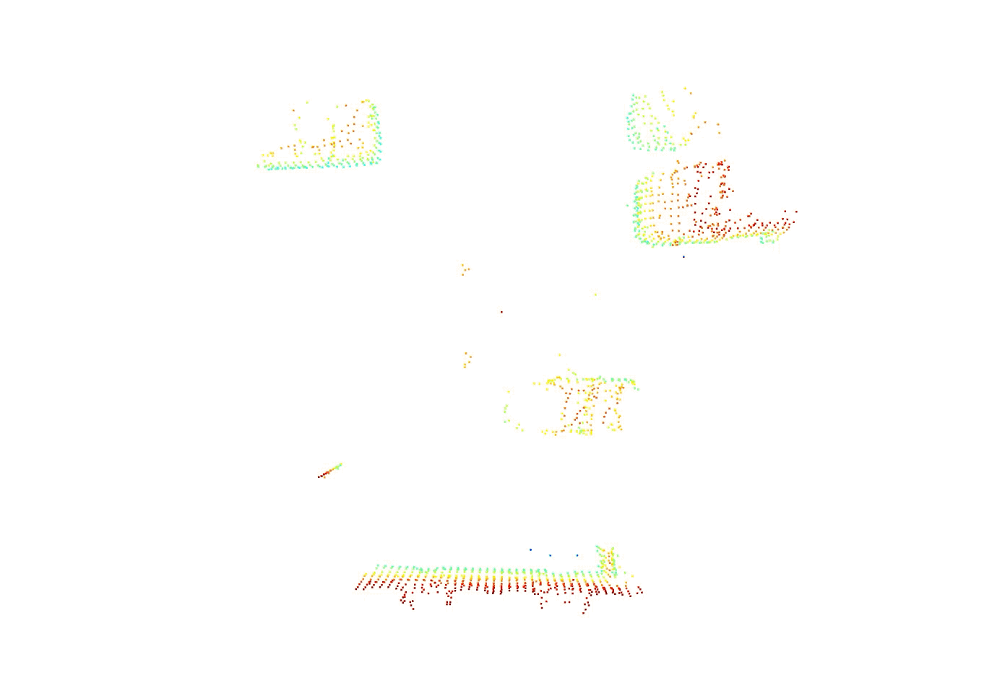

# KDTree Obstacle Detectcion



This is an exploration using KDTree for obstacle detection with PCD (Point Cloud DAta) using Python. It includes a simple implementation of a KDTree class along with various preprocessing techniques and comparisons with other search methods.

## Requirement

* Python Version: `3.11.*`
* Install dependencies from `requreiments.txt`

```sh
pip install -r requirements.txt
```

## Explored

* Simple KDTree class implementation
* Obstacle detection using KDTree
* Preprocessing techniques:
  * Grid voxel filter
  * Plane segmentation
* Basic workflow of obstacle detection
* Comparison with Grid-based nearest search

## LICENSE
